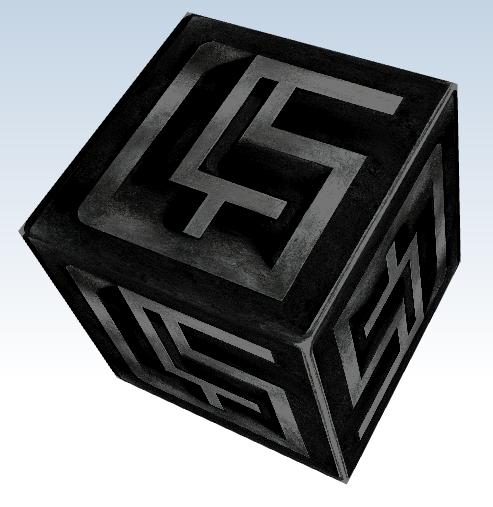

# lithium-app
This is an example application for the [lithium](https://github.com/filipfur/lithium.git) graphics engine. Lithium is a source code oriented game engine written in C++ that uses OpenGL for GPU accelerated graphics rendering. The engine is currently in development and is not ready for production use.



## Dependencies
Lithium uses CMake version 3.22 and C++17. All dependencies on third party libraries are included as submodules.

## Clone
This repository uses submodules. To clone the repository and its submodules use the following command:

```
git clone --recurse-submodules
```

## Build
CMake is used to generate the build files. The build files are generated in the build directory.

### Windows recommendation
Use Visual Studio Code to open the project folder. The CMake Tools extension will automatically configure the project and generate the build files. The project can then be built using the CMake Tools extension.
Note that C++ Build Tools must be installed for Visual Studio Code to build the project. This is done by installing the Visual Studio Build Tools installer from Microsoft.
### MacOS recommendation
Use Visual Studio Code to open the project folder. The CMake Tools extension will automatically configure the project and generate the build files. The project can then be built using the CMake Tools extension.
### Linux recommendation
Build files are generated to the cmake_build directory. Use the Unix Makefile at top level to build the project.

```
make -j
```

Note that its probably possible to build using Visual Studio Code and the CMake Tools extension, but this has not been tested.